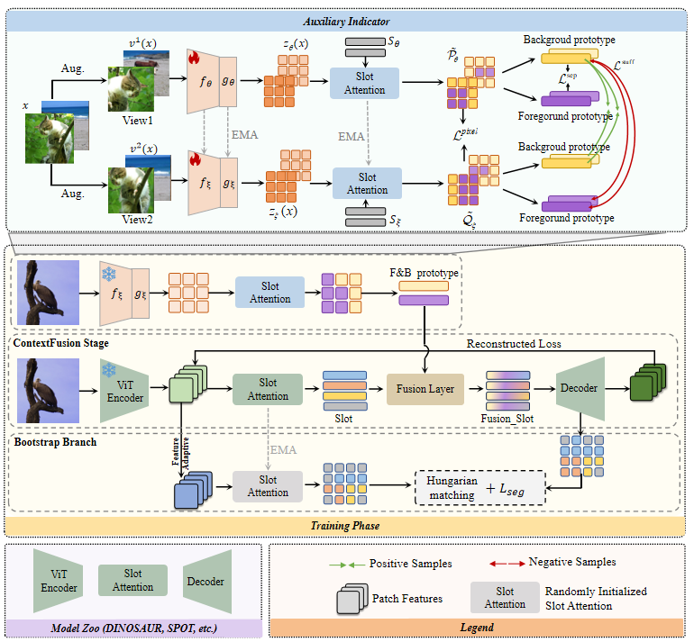

## ContextFusion and Bootstrap: An Effective Approach to Improve Slot Attention-Based Object-Centric Learning

---

This repository contains the official implementation of our work, which is an extension of 
[CVPR 2025: Pay Attention to the Foreground in Object-Centric Learning]. 


<div align="center">
  
</div>

---


## Contents

- [Installation](#installation)
- [Dataset](#Dataset)
- [Training](#training)
- [Evaluation](#evaluation)


---

## Installation

```bash
conda create -n CTFBTP python=3.9.16

conda activate CTFBTP

pip install -r requirements.txt
```

> All experiments run on a single A6000 GPU.

---

## Dataset Preparation

### COCO
Download COCO dataset (`2017 Train images`,`2017 Val images`,`2017 Train/Val annotations`) from [here](https://cocodataset.org/#download) and place them following this structure:
```bash
COCO2017
   ├── annotations
   ├── train2017
   └── val2017
```

### PASCAL VOC 2012

Download PASCAL VOC 2012 dataset from `http://host.robots.ox.ac.uk/pascal/VOC/voc2012/VOCtrainval_11-May-2012.tar`, extract the files and copy `trainaug.txt` in `VOCdevkit/VOC2012/ImageSets/Segmentation`. The final structure should be the following:

```bash
VOCdevkit
   └── VOC2012
          ├── ImageSets
          │      └── Segmentation
          │             ├── trainaug.txt
          │             └── ... 
          │             
          ├── JPEGImages
          ├── SegmentationClass
          └── SegmentationObject
```
### MOVi-C/E
It seems that the commonly used MOVi download site has been closed. We will organize the dataset and upload it later.


### Training(Using the DINOSAUR on the VOC dataset as an example.)
```bash
python train.py --dataset voc --data_path /path/to/VOC2012/ --num_slots 6 --epochs 100 --init_method shared_gaussian --train_permutations standard  --teacher_checkpoint_path /path/to/teacher_checkpoint  --log_path /path/to/logs  --checkpoint_path /path/to/dinosaur_checkpoint 
```


### Evaluation(Using the DINOSAUR on the VOC dataset as an example.)

```bash 
python eval.py  voc --data_path /path/to/VOC2012/ --num_slots 6  --teacher_checkpoint_path /path/to/teacher_checkpoint --checkpoint_path /path/to/dinosaur_checkpoint
```


## License

This project is licensed under the MIT License.

## Acknowledgement

This repository is built using the [SPOT](https://github.com/gkakogeorgiou/spot) 

## Citation
If you find this repository useful, please consider giving a star :star: and citation:
```
@inproceedings{tian2025pay,
  title={Pay attention to the foreground in object-centric learning},
  author={Tian, Pinzhuo and Yang, Shengjie and Yu, Hang and Kot, Alex},
  booktitle={Proceedings of the Computer Vision and Pattern Recognition Conference},
  pages={30281--30290},
  year={2025}
}
```
